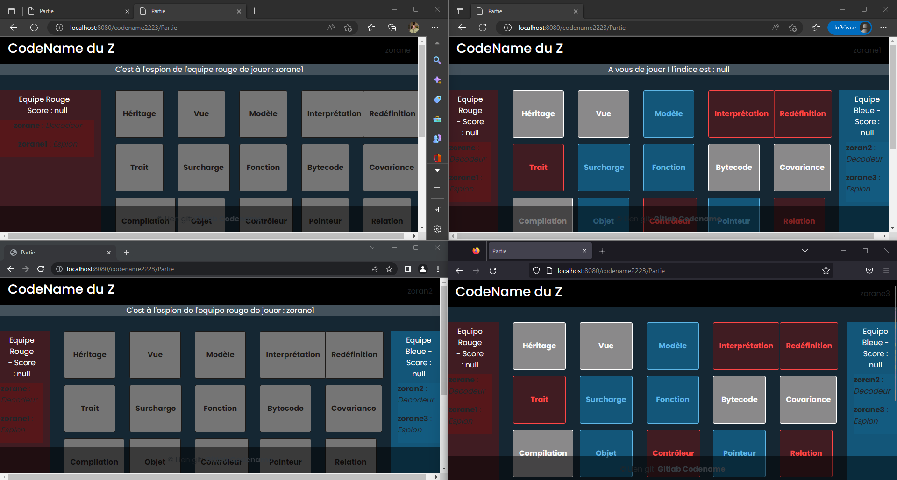

1. **Phase d'initialisation**

Sur le screen shot ci dessous, nous pouvons y apercevoir l'index sur quatre navigateurs différents. 

2. **Mise à jouer de l'index**

Sur le screen shot ci dessous, cette fois ci le premier navigateur a créé une partie tandis que les trois autres, en actualisant leur page, nous pouvons apercevoir un nouveau bouton "rejoindre une partie"

3. **Choix de la partie**

Sur le screen shot ci dessous, les trois navigateurs ayant fait le choix de rejoindre une partie, se retrouvent sur la page où ils doivent choisir l'identifiant de la partie souhaitée. (Parfois il est nécessaire de cliquer sur la liste déroulante, afin de choisir une partie spécifique) 

4. **Choix d'équipe et de rôle**

Sur le screen shot ci dessous, nous sommes dans la phase de "préparation de partie", les joueurs y décideront leur équipe et leur rôle. Néanmoins il faut se méfier de la liste déroulante car parfois elle n'affiche pas le pseudo en tête de liste, cela implique qu'on puisse penser que notre choix ne s'est pas fait. Donc il vous sera nécessaire de cliquer afin de voir toute la liste. 

5. **Lancement de la partie**

Sur le screen shot ci dessous, nous remarquon le boutons "Lancer la partie" n'est disponible que lorsqu'il y a au moins quatre joueurs dans la partie, mais également au moins un joueur par rôle, et que vous êtes créateur de la partie en cours. Donc sur le screen nous voyons à gauche le navigateur du créateur et à droite d'un autre joueur. Cependant ce projet n'est pas compatible pour jouer à plus de quatre joueurs et plus de deux par rôle.  

6. **Partie**

Sur le screen shot ci dessous bien que pas très élégant dû aux quatre fenêtres, montre que les décodeurs ont leurs cartes en grisées (les deux fenêtes à gauche), tandis que les espions ont toutes les cartes avec leur couleur. Nous remarquons également que c'est au tour de l'espion de l'equipe rouge ("zorane1") de jouer car c'est la première manche et que l'équipe rouge a le plus de mot à trouver (neuf mots), donc la première à jouer. 

7. **Première manche**

Sur le screen shot ci dessous nous rentrons plus en détails concernant la première manche. Comme c'est la première manche le score des deux équipes est à null comme indiqué en haut à droite et gauche. Il n'y a pas d'indice pour l'instant donc initialisé à null également. En dessous de la grille des cartes nous avons le champ où l'on doit indiquer notre indice (indice + nombre de mots associés) et nous envoyons l'indice en appuyant sur le boutton envoyer. Néanmoins aucune vérfication n'est faite sur l'indice, cette dernière est laissée à la bonne foi et au fair play des joueurs. 

